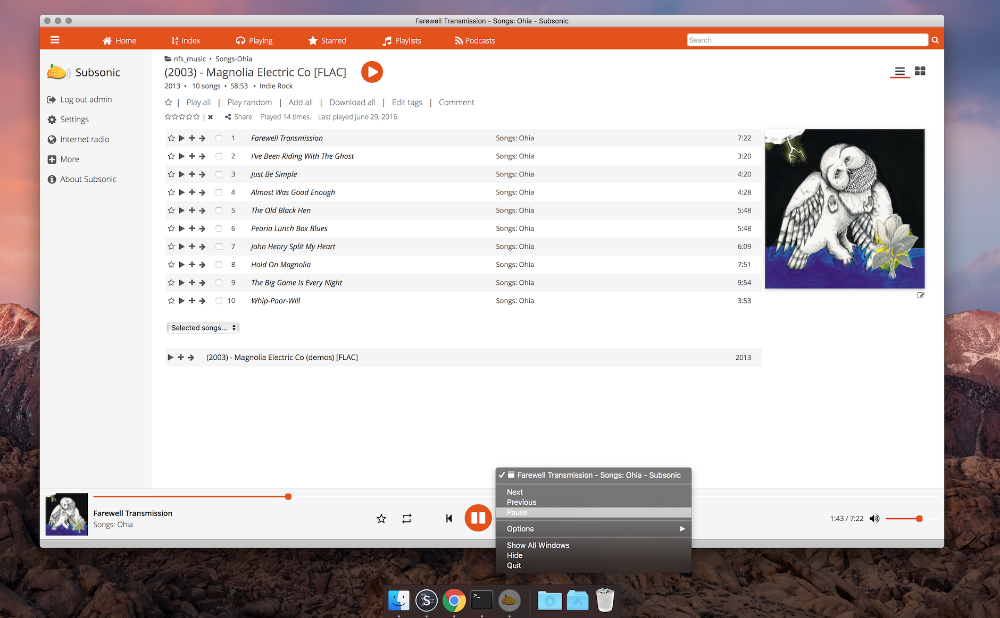

subsonic-fluid
======
This project contains userscripts and assets for creating a Subsonic desktop client for OSX using [Fluid](http://fluidapp.com/). Icon assets will work in the free version, but to enable userscripts you will need to purchase a license.

Currently supports Next, Previous, Pause/Play.

Update Jan 31 2017: Last version supports HTML5 player in Subsonic 6. Use the subsonic6.js file in the repo. I'll leave the version 5 up in case someone still needs it.

How-to Install (Subsonic 6.0 HTML Player)
-------
- Subsonic -> In the tool bar (between Window & help), click on the lighting bolt -> Open Scripts Folder
  - Path: `/Users/<username>/Library/Application Support/Fluid/`
- Save the contents of [subsonic6.js](https://raw.githubusercontent.com/rossbates/subsonic-fluid/master/subsonic6.js) to: `./subsonic6.js`
  - Path: `/Users/<username>/Library/Application Support/Fluid/subsonic6.js`
- Subsonic -> Window -> Userscript
- (Bottom left), `+` (To create a new userscript) -> Patten `*<IP>:<port>*`
  - Example: `*192.168.1.10:8080*`
- Paste into script editor: `window.fluid.include('/Users/<username>/Library/Application Support/Fluid/subsonic6.js');`
- Quit and re-open Subsonic (may take a few seconds for the script to start working)
- Enjoy
