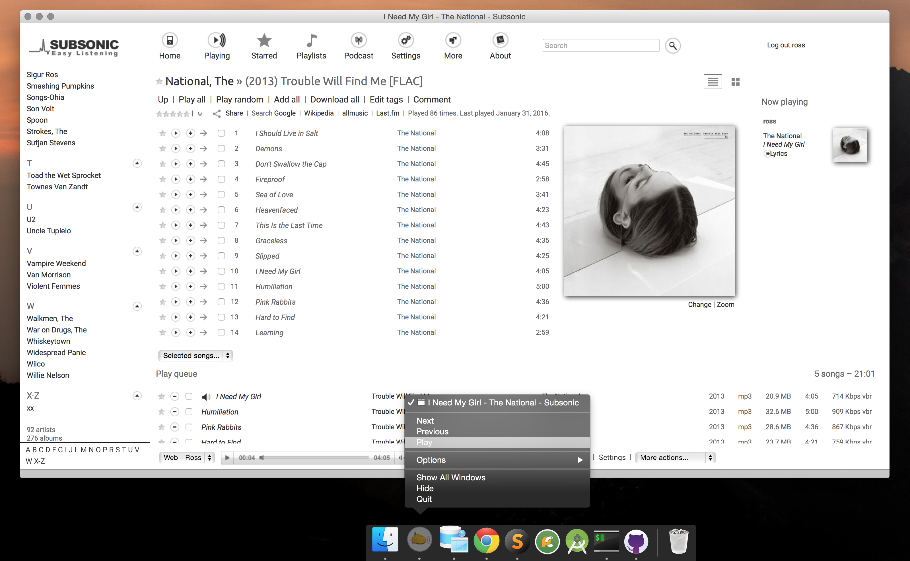

subsonic-fluid
======
This project contains userscripts and assets for creating a Subsonic desktop client for OSX using [Fluid](http://fluidapp.com/). Icon assets will work in the free version, but to enable userscripts you will need to purchase a license.

Currently supports Next, Previous, Pause/Play.

Notes
-------
The easiest way I've found to manage integrating the script with Fluid is using an include statement in the script editor and pointing it to your .js files. ie window.fluid.include('/path/to/subsonic.js')
    
    